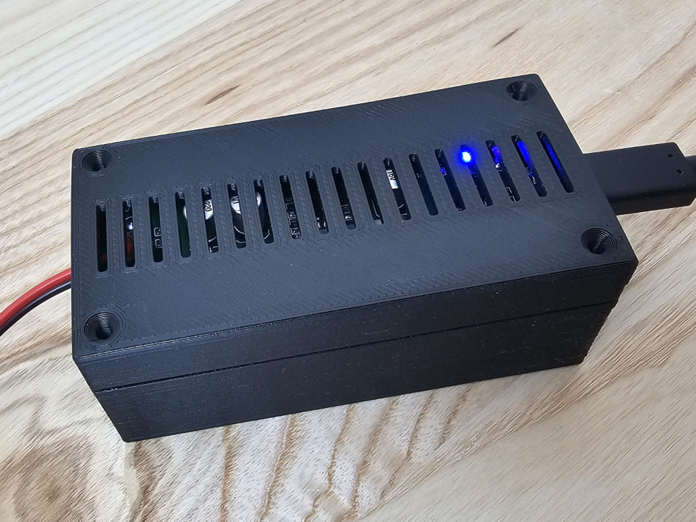
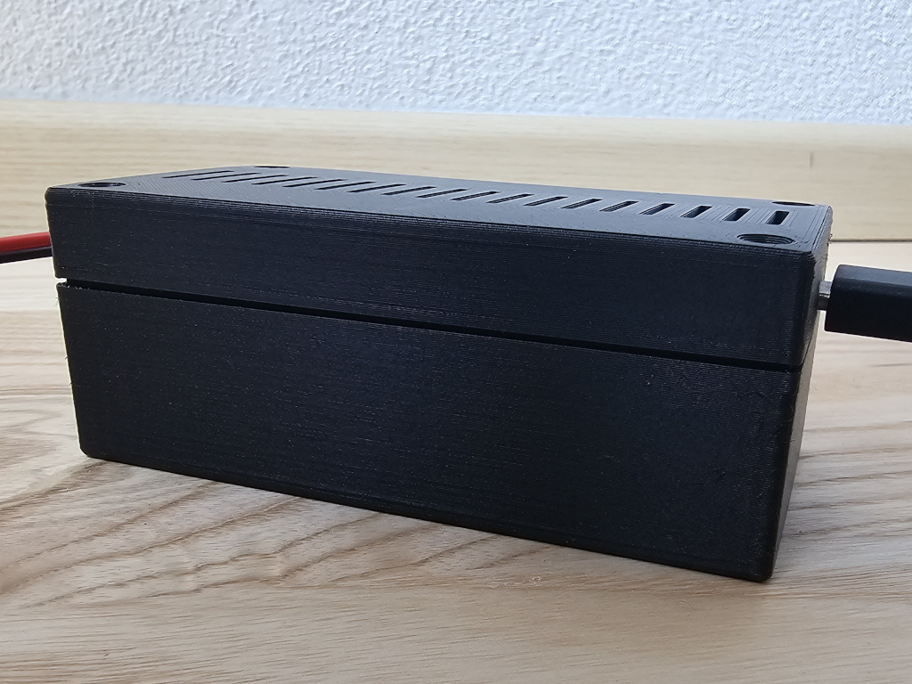
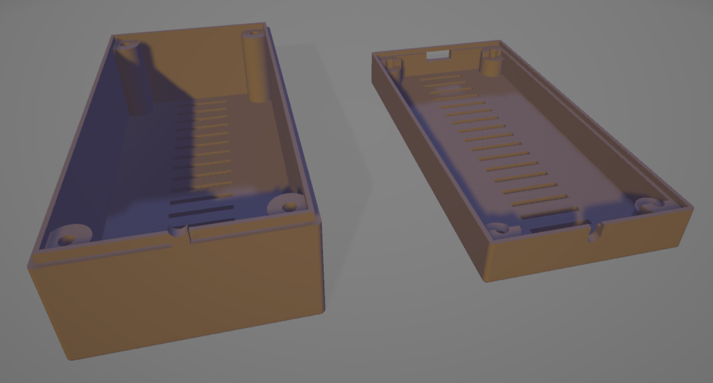

# Customizable Electronic Component Case

## Description
This OpenSCAD script generates a parametric (customizable) case for electronic components or other projects. It's designed to create enclosures for PCBs with adjustable dimensions and features.

## Parameters
The script includes several customizable parameters, including:
- Inner case dimensions
- Mounting post configuration
- Wall thickness
- Ventilation options
- Interlocking mechanism details

Refer to the comments in the script for detailed explanations of each parameter.

## Images
Here are some images of the case:

*Photo 1: Assembled case*

*Photo 2: Assembled case*

*3D rendering of the case design*

## License
This project is licensed under the GNU General Public License v3.0 (GPLv3). 

Copyright (C) 2024 DMA

## Contributing
Contributions to improve the script are welcome. Please feel free to submit issues or pull requests on the project repository.
